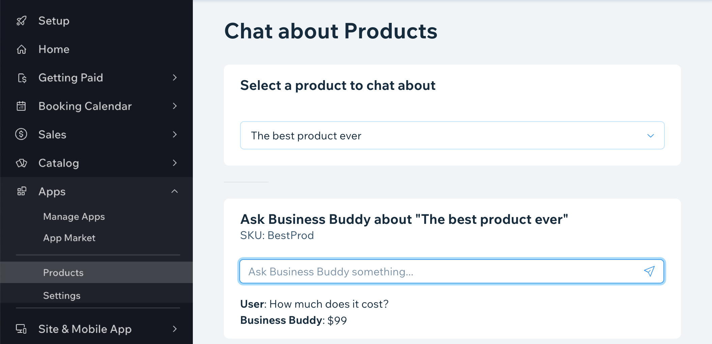

# App Example

In this example, you'll learn how we built an app named Business Buddy. The app creates a dashboard chatbot connected to an AI. The AI answers questions about products in the site's store.

The app is built from:

- Frontend: Two dashboard pages
  - Products page: Allows the user to select a product from the site's store and chat with the AI about it
  - Settings page: Allows the user to give instructions as to how the AI behaves
- Backend: Express Node.js server
  - Server: A server that responds to product chat requests by calling the OpenAI API and to settings requests by calling the mock database
  - Database: A mock database that holds the AI behavior settings per user

The app demonstrates how to:

- Build dashboard pages using:
  - [Wix Design System](https://www.wixdesignsystem.com/) React components
  - [Wix Dashboard SDK](https://dev.wix.com/api/client/dashboard-sdk/)
  - CSS
- Work with Wix Apps such as Stores using the [Wix SDK for App Development](https://dev.wix.com/api/sdk/sdk-setup:-wix-apps/set-up-the-wix-sdk)
- Work with external services, such as [OpenAI](https://openai.com/)
- Work with CORS on your server
- Authenticate requests from the dashboard to the server
- Use the app instance ID to differentiate between the many instances of the app installed on user sites

You can see the finished app code in [this GitHub repo](https://github.com/wix-incubator/business-buddy-example-app).

> If you want to run the app code from the repo you'll need to do some setup first:
>
> - Create an App ID
>   1. Create a new app in the [Wix Developers Center](https://dev.wix.com/).
>   1. Go to the app's dashboard and copy its App ID.
>   1. Replace the value of the `appId` property in the **wix.config.json** file with the App ID from your new app.
>   1. Replace the value of the `wix.run` URL in the **server.ts** whitelist to use the App ID from your new app.
> - Request permissions
>   1. Go to your new app in the Wix Developers Center.
>   1. Go to the Permissions tab in the app's dashboard.
>   1. Request permissions to query store products.
> - Configure your OpenAI API key
>   1. Create an [OpenAI platform account](https://platform.openai.com/account).
>   1. Create an [OpenAI API key](https://platform.openai.com/account/api-keys).
>   1. In the backend project, create an environment variable named `OPENAI_API_KEY` and set its value to your API key.
> - Configure your app secret
>   1. Select your app from the list of apps.
>   1. Go the [My Apps page](https://dev.wix.com/apps) in the Wix Developers Center.
>   1. Click **OAuth** in the sidebar.
>   1. Find, show, and copy your app's secret key.
>   1. In the backend project, create an environment variable named `WIX_APP_SECRET` and and set its value to your app secret.
> - Optionally configure a port for your server (defaults to 8090)
>   1. In the backend project, create an environment variable named `PORT` and set its value to your desired port number.

## Up next

Next we'll see how to create dashboard pages and configure how they show in the sidebar.
