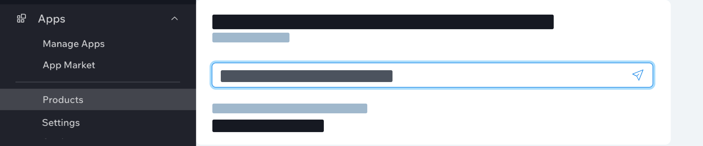

# Dashboard Page Setup

In the Business Buddy app, the pages appear in the dashboard as follows.

To create this structure, we place dashboard page files in subfolders of the **dashboard/pages** folder

## Dashboard page files

A pair of **page.json** and **page.tsx** files defines one dashboard page. The **page.json** files define the page metadata and the page **page.tsx** file defines the page UI and functionality. Our app project has two sets of these file pairs in subfolders under the **dashboard/pages** folder.

Each file pair exists in a folder that determines the route to a page. So our app has two pages with the routes **/product** and **/settings**.

## Up next

Now that you understand how to set up dashboard pages, we can see how to add components to the pages to create their look and feel.
