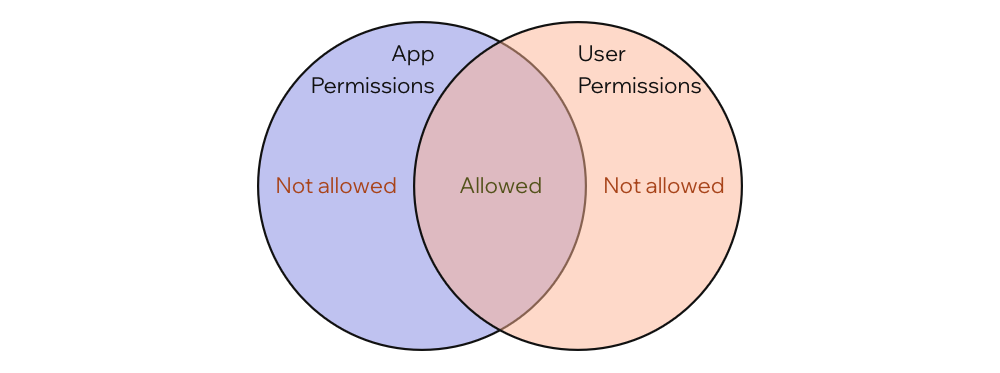

# Working with Wix APIs

As you build your app, you'll need to interact with Wix APIs to get information about the site your app is installed on, the user who is using your app, and more. To do so, you need to use Wix APIs.

Wix offers a rich set of APIs for different business solutions that enable you to build powerful apps.

To call Wix APIs you use:

- The [Wix JavaScript SDK](https://dev.wix.com/api/sdk/)
- The [Wix REST API](https://dev.wix.com/api/rest/)

The SDK is the preferred method of consuming Wix APIs since it offers a simpler authentication experience.

> **Note:** We are actively working on providing JavaScript SDKs for all our REST APIs. In the meantime, if you can't find something in the SDK, you can [call the REST API using the SDK](#using-rest-apis-with-the-wix-sdk).

## API permissions

In order to make API calls, you need to work with the Wix permissions model. Without the proper permissions, your app won't have access to the resources it needs.

For example, if your app works with a site's blog, you need to request permissions to interact with the blog.

### Request permissions

When users install your app, they're presented with a permissions dialog that lists the permissions your app is requesting. The user can choose to grant or deny the permissions your app is requesting.

You should only request the permissions your app requires. Don't request permissions you don't need.

To read more about adding permissions to your app, see [Adding Permissions to your app](https://devforum.wix.com/kb/en/article/how-to-add-permissions).

### Dashboard permissions

When developing [dashboard pages](dashboard_pages.md), your code can access APIs with the permissions of the currently logged in user, but scoped to the permissions your app has been granted.

This means that the permissions available in a dashboard extension's code are the intersection of the permissions your app has been granted and the permissions of the user that is currently logged in to the Wix Dashboard.



So if your app has permissions to add products to a store, but the current user does not, your app will not be able to add products to the store. Conversely, if the current user has permissions to add products to a store, but your app does not, your app will not be able to add products to the store. The only way your app can add products to a store is if both your app and the current user have permissions to do so.

## Work with the Wix SDK

The [Wix JavaScript SDK](https://dev.wix.com/api/sdk/) provides an easy, type-safe way to interact with Wix REST APIs. When possible, you should use the SDK, as opposed to the REST API, as it removes boilerplate code and handles authentication for you.

### Install

To install the Wix SDK, run one set of the following commands:

#### npm

```bash
npm install @wix/sdk
npm install @wix/dashboard-sdk
```

#### yarn

```bash
yarn add @wix/sdk
yarn add @wix/dashboard-sdk
```

This installs the SDK Client and the Dashboard SDK, which you need to authenticate the client.

Depending on which functionality you need to use, also install the necessary modules.

For example, to work with stores, run one of the the following commands:

#### npm

```bash
npm install @wix/stores
```

#### yarn

```bash
yarn add @wix/stores
```

You can find a list of all the modules in the [SDK documentation](https://dev.wix.com/api/sdk/).

### Import

Once you have everything installed, you need to import the functionality you want to use in your code.

You will always need to import `createClient` and `authStrategy` since you use them to create an authenticated client.

```ts
import { createClient } from '@wix/sdk';
import { authStrategy } from '@wix/dashboard-sdk';
```

Depending on which functionality you need to use, also import the necessary modules.

For example, to work store products, add the following import.

```ts
import { products } from '@wix/stores';
```

### Create a client

Once you have everything installed and imported, you need to create a client.

In a dashboard component, you create a client by calling the `createClient()` function, using the `authStrategy()` function to define the authentication method, and include a list of all the modules you will use with the client.

```ts
const wixClient = createClient({
  auth: authStrategy(),
  modules: {
    products,
  },
});
```

### Call an API

You can now call APIs with the `wixClient` object like this.

```ts
const products = await wixClient.products
  .queryProducts()
  .startsWith('name', 'Cool')
  .find();
```

### Using REST APIS with the Wix SDK

If you need to use a REST API that is not yet supported the SDK, you can still benefit from the simplified authentication of the SDK by using the SDK's `fetch()` function.

The `fetch()` function is already bound to the Wix authentication strategy, so you don't need to do any additional authentication.

Here is an example of using the `fetch` method to call the Wix Stores Products API.

```ts
const res = await wixClient.fetch(
  'https://www.wixapis.com/stores/v1/products/query',
  {
    method: 'POST',
    headers: {
      'Content-Type': 'app/json',
    },
    body: JSON.stringify({}),
  }
);

const { products } = await res.json();
return products;
```
