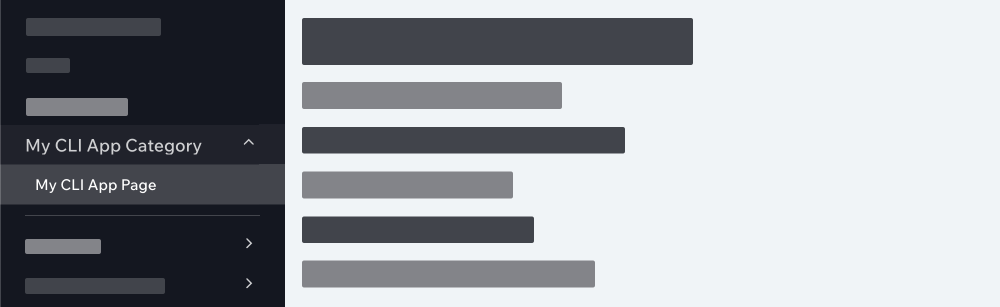
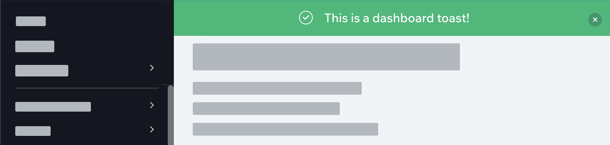
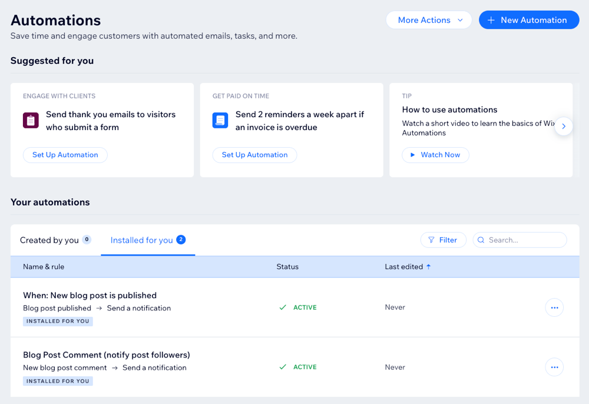

# Platform Overview and Terminology

The Wix Platform is made up of a broad range of products all of which are ultimately aimed at empowering Wix users to build a web presence and manage their businesses online.

Wix is continually working on opening up its platform to developers, enabling them to customize and extend the products on the platform.

One of the ways you, as a developer, can extend the Wix Platform is by creating Wix Apps using the Wix CLI for Apps. The apps you build with the CLI can be used by millions of Wix users to take their sites and businesses to the next level.

In this section, we describe the parts of the Wix Platform that are most relevant to developers of Wix Apps.

## Site editors

The main interface with the Wix Platform and the historical starting point for most Wix users is one of the site editors. The editors are where Wix users build and edit their sites.

The editors are visual, drag-and-drop editors that allow users to:

- Create visually appealing sites without having to know HTML, CSS, etc.
- Customize site functionality with JavaScript code using [Velo](https://www.wix.com/velo)
- Manage site content including text, media, etc.
- Add and manage business solutions, such as a store or blog, from a selection of apps built by Wix and third-party developers, such as yourself

## Site dashboard

The site dashboard is a site's management hub. The dashboard is only accessible to site owners and their collaborators.

The dashboard allows users to:

- Manage site content including text, media, etc.
- Add and manage business solutions, such as a store or blog, from a selection of apps built by Wix and third-party developers, such as yourself
- Monitor and analyze SEO performance, sales reports, site traffic, etc.

### Dashboard structure

When building an app with the CLI, you can add pages to the site dashboard. It's important to understand how the dashboard is structured before adding pages.

#### Dashboard sidebar

The dashboard sidebar is where users navigate to the various pages in the dashboard. The sidebar is organized into categories and pages. Pages can be at the top level or nested under a category.

#### Dashboard toast

A dashboard toast is a message that appears at the top of the dashboard.

### Dashboard SDK

When building dashboard pages, you can use the [Dashboard SDK](https://dev.wix.com/docs/client/api-reference/dashboard-sdk/intro) to interact with the dashboard from your app.

You can use the SDK to:

- Navigate users to pages in the dashboard
- Display modals
- Display alerts and updates using toasts

## Wix apps

Wix apps are apps that users can install on their sites. Apps are either created by Wix or third-party developers, such as yourself. Apps help users enhance their businesses and online presence.

Apps add functionality to the site dashboard, the site editors, or both.

### App backends

Many apps have a backend as well. App backends are often used to store data, interact with third-party APIs, and more. Wix does not supply the infrastructure for your app backend.

### App instances

Each time your app is installed on a site, an app instance is created.

You can use the app instance to:

- Authenticate requests from your app on your app backend
- Know which instance of your app has sent the request and act accordingly

## Developers Center

The [Wix Developers Center](https://dev.wix.com/) is where you manage the apps you've built. It is also an alternative way to create apps.

As a developer using the Wix CLI for Apps, you don't create your app in the Developers Center, but you still may need to use it for a number of reasons:

- To request permissions for your app
- To integrate your CLI app with an app created in the Developers Center
- To retrieve your app secret used for authorizing requests in your app backend

## Wix Design System

The [Wix Design System](https://www.wixdesignsystem.com/) is a library of [React](https://react.dev/) components for building beautiful and intuitive product experiences. It is the design system that Wix developers use to create Wix product experiences. You can use this same system to create apps that fit seamlessly into the Wix Platform.

Here is an example of a page built using components from the Wix Design System:

## Wix SDK and APIs

When building an app, you often want to access information from the site that your app is installed on and from the Wix apps installed on that site. For example, you might want your app to work with store products.

### JavaScript SDK

The preferred method of working with a site and its apps is through the [Wix JavaScript SDK](https://dev.wix.com/api/sdk/introduction).

The SDK includes an [npm](https://www.npmjs.com/) package that manages authentication and communication with the Wix Platform. Each domain, such as Contacts or Stores, also has its own npm package.

These packages are fully typed, making the structure of parameters and fields predictable and easy to work with.

### REST API

Because the Wix SDK is still in active development, there may be some functionality you want to use that is not yet exposed in the SDK. In that case, you can check to see if the functionality is exposed in the [Wix REST API](https://dev.wix.com/api/rest/getting-started).

### Permissions

Whether using the JavaScript SDK or the REST API, your app needs to request permissions before gaining access to a site's data. You [request permissions](https://devforum.wix.com/kb/en/article/how-to-add-permissions) using the [Wix Developers Center](https://dev.wix.com/).

You should never ask for more permissions than the ones required for your app to function. When installing your app, users see which permissions your app requires and may decide not to install your app if it asks for too many permissions.

## Users, visitors, and members

There are lots of different types of actors who work within the Wix Platform. This is how we refer to them:

- **Users**: People who create and manage sites. They are also the people who install and work with your apps.
- **Visitors**: People who visit and interact with published sites.
- **Members**: Visitors who are logged into a site as site members.
